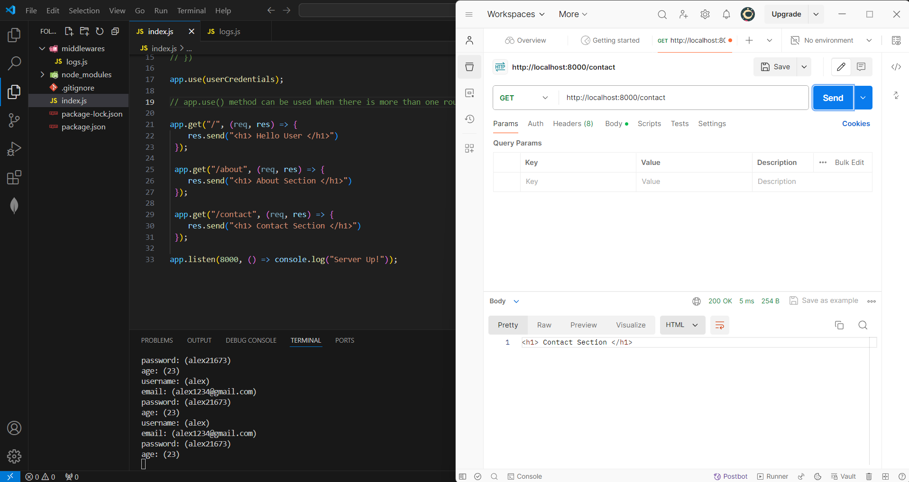

## Middleware

- After the request from the client, before the response from the server, If middlewares exist, It'll be verified.
- When there is more than one route, middlewares need to be checked in each route, Hence app.use() method is used
- On directing to different possible routes, middlewares will be checked on each route.
- Here, The middleware is used to check the user Credentials.

### ScreenShot

