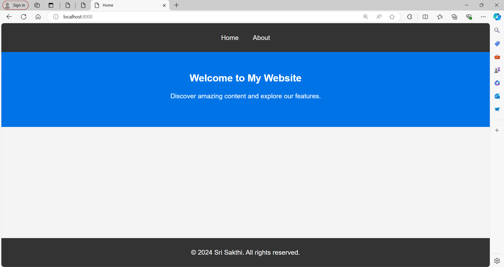

# Template Engine (ejs)

- In this Repository, Template Engine is practiced with proper routes, Controllers and Views Folder.
- The Frontend is built using HTML, CSS which is Stored in "views" folder's ejs file. 
- The backend uses Express to serve the front-end files.

## Technology Used

- **Frontend**: HTML 5, CSS
- **Backend**: Express.js 
- **Code Editor**: VS Code

## Usage

#### Prerequisites

- Node.js
- npm (Node Package Manager)

#### Installation

1. Clone Repository:

    - Clone the Repo or copy the required files to your local Device.
    - Navigate to the project Directory

    ```bash
    cd "Template Engine"

2. Install the dependencies:

    ```bash
    npm install

3. Running the App: 
    To run the app in development mode, use the following command:

    npm run dev

    The app will be available at http://localhost:8000.

## ScreenShots




